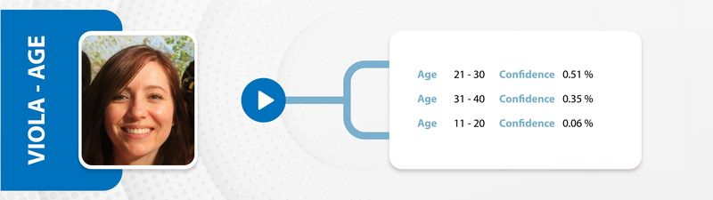

# Viola-Age
[  ](https://bintray.com/darwinfrancis/Viola/com.darwin.viola.age/_latestVersion)
[](http://developer.android.com/index.html)
[](https://android-arsenal.com/api?level=15)
[](https://github.com/darwinfrancis/face-perception/blob/master/LICENSE.txt)


With Viola Age classification library, you can find age range of a given face bitmap.



## Getting Started
**Demo application**

Download sample application [sample_v_1.0.1](app-viola-age-v1.0.1-demo.apk.apk)

**Compatibility**
 * *Minimum Android SDK* : Viola Age 1.0.1 requires a minimum API level of 21.

**Installation**

Download the latest aar from [JCenter](https://bintray.com/darwinfrancis/Viola/download_file?file_path=com%2Fdarwin%2Fviola%2Fage%2F1.0.1%2Fage-1.0.1.aar) or grab via

Gradle:
```gradle
dependencies {
  implementation 'com.darwin.viola:age:1.0.1'
}
```

or Maven:

```xml
<dependency>
  <groupId>com.darwin.viola</groupId>
  <artifactId>age</artifactId>
  <version>1.0.1</version>
  <type>pom</type>
</dependency>
```


## Usage
**Kotlin**
```kotlin
val violaAgeClassifier = ViolaAgeClassifier(listener)

violaAgeClassifier.findAgeAsync(bitmap) //asynchronous call using callback interface         

private val listener: AgeClassificationListener = object : AgeClassificationListener {

        override fun onAgeClassificationResult(result: List<AgeRecognition>) {}

        override fun onAgeClassificationError(error: String) {}
}


//OR using synchronous function call
val result:List<AgeRecognition> = violaAgeClassifier.findAgeSynchronized(faceBitmap)   //synchronous call   
```


**Java**
```java
ViolaAgeClassifier violaAgeClassifier = new ViolaAgeClassifier(listener);

violaAgeClassifier.findAgeAsync(bitmap); //asynchronous call using callback interface

private final AgeClassificationListener listener = new AgeClassificationListener() {
        @Override
        public void onAgeClassificationResult(@NotNull List<AgeRecognition> result) { }

        @Override
        public void onAgeClassificationError(@NotNull String error) { }
};

//OR using synchronous function call
List<AgeRecognition> result = violaAgeClassifier.findAgeSynchronized(faceBitmap);   //synchronous call
```

### Age classification result
Viola Age Classification provides the following values in Result class

| Result | Description | Type |
| :--- | :--- | :--- |
| `result` |  age recognition result list | AgeRecognition |

## Author
Darwin Francis - @darwinfrancis on GitHub, @darwin-francis on linkedin

## Other works
[Viola-Face](https://github.com/darwinfrancis/viola) face detection and crop library for android.

## Contributing
Pull requests are welcome. For major changes, please open an issue first to discuss what you would like to change.

License
-------

    MIT License

    Copyright (c) 2020 Darwin Francis

    Permission is hereby granted, free of charge, to any person obtaining a copy
    of this software and associated documentation files (the "Software"), to deal
    in the Software without restriction, including without limitation the rights
    to use, copy, modify, merge, publish, distribute, sublicense, and/or sell
    copies of the Software, and to permit persons to whom the Software is
    furnished to do so, subject to the following conditions:

    The above copyright notice and this permission notice shall be included in all
    copies or substantial portions of the Software.
    
    THE SOFTWARE IS PROVIDED "AS IS", WITHOUT WARRANTY OF ANY KIND, EXPRESS OR
    IMPLIED, INCLUDING BUT NOT LIMITED TO THE WARRANTIES OF MERCHANTABILITY,
    FITNESS FOR A PARTICULAR PURPOSE AND NONINFRINGEMENT. IN NO EVENT SHALL THE
    AUTHORS OR COPYRIGHT HOLDERS BE LIABLE FOR ANY CLAIM, DAMAGES OR OTHER
    LIABILITY, WHETHER IN AN ACTION OF CONTRACT, TORT OR OTHERWISE, ARISING FROM,
    OUT OF OR IN CONNECTION WITH THE SOFTWARE OR THE USE OR OTHER DEALINGS IN THE
    SOFTWARE.
